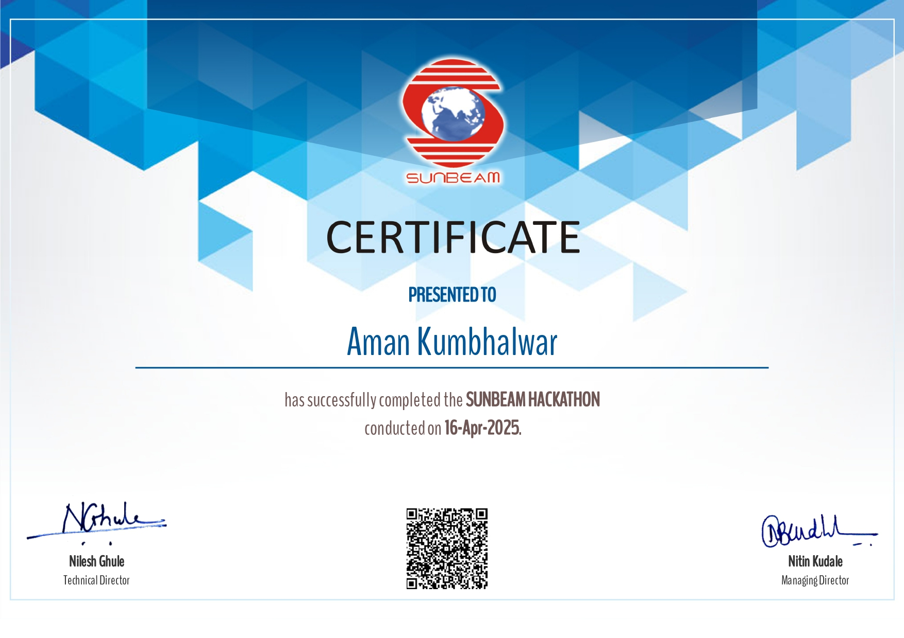

# Sunbeam Blog Management System

A Java console application for managing blogs with user authentication, category management, and full CRUD operations for blog posts.

## Project Overview

This Blog Management System allows users to register, login, create and manage blog posts, categorize content, and perform various operations including searching and filtering blogs.

## Features

- **User Management**
  - Registration and login
  - User profile management
  - Authentication system

- **Blog Management**
  - Create, read, update, and delete blog posts
  - View all blogs or filter by user
  - Search functionality
  - Content editing

- **Category System**
  - Predefined blog categories
  - Create new categories
  - Categorize blog posts

## Technical Details

### Technology Stack

- **Language**: Java
- **Database**: MySQL
- **Build Tool**: Maven
- **Dependencies**: MySQL Connector (v8.0.31)

### Project Structure

```
sunbeam-hackathon-blog/
├── src/
│   ├── main/
│   │   ├── java/
│   │   │   └── org/example/
│   │   │       ├── domain/        # Data model classes
│   │   │       │   ├── Blog.java
│   │   │       │   ├── Category.java
│   │   │       │   └── User.java
│   │   │       ├── dao/           # Data Access Objects
│   │   │       │   ├── BlogDao.java
│   │   │       │   ├── CategoryDao.java
│   │   │       │   └── UserDao.java
│   │   │       └── Main.java      # Application entry point
│   │   └── resources/
│   │       ├── db_schema.sql      # Database schema
│   │       └── application.properties  # Configuration
│   └── test/                      # Test directory
└── pom.xml                        # Maven configuration
```

### Database Schema

The application uses a MySQL database with the following tables:
- `users`: Stores user information including credentials
- `categories`: Manages blog categories
- `blogs`: Stores blog posts with references to users and categories

## Getting Started

### Prerequisites

- Java 23 or higher
- MySQL Server
- Maven

### Installation

1. Clone the repository
2. Set up the MySQL database:
   ```
   mysql -u root -p < src/main/resources/db_schema.sql
   ```
3. Update database credentials in `src/main/resources/application.properties` if needed
4. Build the project:
   ```
   mvn clean package
   ```
5. Run the application:
   ```
   java -cp target/movieReview-1.0-SNAPSHOT.jar org.example.Main
   ```

## Usage

The application provides a console-based interface with the following main menus:

### Login Menu
- Login with existing credentials
- Register as a new user
- View all users
- Exit

### Main Menu (after login)
- View/Add categories
- Create/Edit/Delete blogs
- View all blogs or only your blogs
- Read blog content
- Search blogs
- Logout

## Recognition

This project was developed as part of the Sunbeam Hackathon held on April 16, 2025. The developer successfully completed the hackathon and received a certificate of completion.



## License

This project was created as part of a hackathon and is intended for educational purposes. 